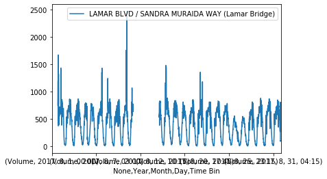

# Traffic-prediction

Paul Lecomte, Léo Hardy

Ce git résume le projet effectué lors du [cours de Machine Learning de M.Cristophe Cerisara](https://members.loria.fr/CCerisara/#courses/machine_learning/).

L'objectif est d'effectuer une prévision de traffic pour la ville d'Austin, à l'aide des données des radars de la ville, [disponibles sur ce challenge kaggle.](https://www.kaggle.com/vinayshanbhag/radar-traffic-data)

*Note à l'intention de M.Cerisara : le nombre de commit de chacun de nous deux n'est pas forcément représentatif de nos travaux respectifs étant donné que nous avons travaillé et réfléchi à deux sur la même machine à de nombreux moments.*

## Sommaire

 - [Etat de l'art et motivation de l'approche choisie](#etat-de-l'art)
 - [Data processing](#data-processing)
 - [Le choix du modèle](#choix-du-modele)
 - [Optimisation des hyperparamètres](#optimisation)
 - [Pistes d'amélioration](#ameliorations)

## Etat de l'art et motivation de l'approche choisie 

Nous nous sommes en premier lieu penchés sur plusieurs articles de recherche sur la prédiction de traffic.
Celui qui a le plus retenu notre attention est [celui-ci](https://www.researchgate.net/publication/333096680_Deep_Autoencoder_Neural_Networks_for_Short-Term_Traffic_Congestion_Prediction_of_Transportation_Networks), et propose de créer une représentation graphique de la ville avec une coloration présentant la densité de traffic.
Un autre article dont nous nous sommes inspirés est [celui-ci](https://www.researchgate.net/publication/340158853_Air_Pollution_Prediction_Using_Long_Short-Term_Memory_LSTM_and_Deep_Autoencoder_DAE_Models/link/5e7b59f7299bf1f3874008f0/download)

Cet article propose de combiner un Deep Autoencoder (DAE) et un Long Short Term Memory (LSTM). Cette approche nous a semblé trop complexe dans le cadre d'une première solution au problème proposé.

Dans l'optique d'avoir des résultats expérimentaux dans le temps imparti il nous a semblé fondamental pour pouvoir travailler sur l'ajustement d'hyperparametres et l'interpretation de résultats.
Nous nous contentons donc de la mise en place d'un LSTM suivis d'une couche dense.

Afin d'affiner notre démarche nous avons décidé de créer un modèle dont l'apprentissage est réalisé sur un seul radar. Si les résultats sont concluants, nous généraliserons notre approche.

## Data processing 

(Les graphiques suivant sont effectués avec la librairie matplotlib)

Une fois les données nettoyées (espaces inutiles avant le nom des lieux), nous nous sommes posé la question de la complétion de l'information fournie. En d'autres termes, combien de mesure manque-t-il par radar dans l'intervalle de temps proposé, pour chaque radar ?

Voici le pourcentage de valeurs manquantes pour chacun des radars :

radar | pourcentage de Nan
---|---
100 BLK S CONGRESS AVE (Congress Bridge) | 8.12%
1000 BLK W CESAR CHAVEZ ST (H&B Trail Underpass) | 8.41%
1612 BLK S LAMAR BLVD (Collier) | 23.7%
2021 BLK KINNEY AVE (NW 300ft NW of Lamar) | 81.0%
3201 BLK S LAMAR BLVD (BROKEN SPOKE) | 27.7%
400 BLK AZIE MORTON RD (South of Barton Springs Rd) | 22.0%
700 BLK E CESAR CHAVEZ ST | 8.62%
BURNET RD / PALM WAY (IBM DRIVEWAY) | 15.9%
BURNET RD / RUTLAND DR | 16.6%
CAPITAL OF TEXAS HWY / CEDAR ST | 36.3%
CAPITAL OF TEXAS HWY / LAKEWOOD DR | 11.1%
CAPITAL OF TEXAS HWY / WALSH TARLTON LN | 11.2%
CONGRESS AVE / JOHANNA ST (Fulmore Middle School) | 26.9%
LAMAR BLVD / MANCHACA RD | 10.7%
LAMAR BLVD / N LAMAR SB TO W 15TH RAMP | 24.1%
**LAMAR BLVD / SANDRA MURAIDA WAY (Lamar Bridge)** | **4.35%**
LAMAR BLVD / SHOAL CREEK BLVD | 6.65%
LAMAR BLVD / ZENNIA ST | 33.6%

Nous avons ainsi décidé d'entraîner le réseau avec les données du radar nommé "LAMAR BLVD / SANDRA MURAIDA WAY (Lamar Bridge)", car le nombre de valeurs manquantes est faible.

Pour palier à ce léger manque, nous avons choisi de remplacer les valeurs manquantes par une régression linéaires entre les valeurs encadrant le laps de temps dont nous ignorons les mesures.
Par exemple, ci dessous la représentation du volume de voitures détectées au mois d'août 2017, avant d'extrapoler les données manquantes, et après.

Dans un second temps, étant donné la répartition des données illustrées par l'histogramme ci-dessous, nous avons choisi de considérer un traffic par quart d'heure entre 0 et 1000, que nous avons ensuite normalisé entre 0 et 1.

## Le choix du modèle 

### LSTM 

Le Long short-term memory network est un réseau récurrent. Généralement, les réseaux récurrents permettent de prendre en compte la nature séquentielle des données ce qui s'avère particulièrement intéressant dans le cas de la prédiction de séries temporelles. Le réseaux récurrent ont une fâcheuse tendance à subir le problème d'extinction du gradient, ce qui peut les rendre facilement inopérants.
C'est notamment pour éviter ce phénomène que le LSTM à fait son apparition. Le principe de cellule permet de gérer très précisément l'enregistrement de données au fil de la récurrence.

### Implementation 

Dans le cadre de notre projet, nous avons choisi de travailler avec un réseau LSTM "stateless". Ainsi, lorsque le réseau parcours une fenêtre, il ne conserve pas la valeur de la cellule cachée (hidden state), ni la valeur de la cellule d'état (cell state). Cette variante est possible car nous considérons que toutes les journées sont indépendantes les unes des autres (car nous avons finalement choisi de travailler avec une window de 24 heures).

Enfin, l'avantage de travailler avec un LSTM stateless est qu'il nous laisse la possibilité de travailler simplement avec la technique de "mini-batch".  

## Optimisation des hyper-paramètres 

### batch size

### learning rate 

Nous avons testé plusieurs learning rate allant de de 10E-1 à 10E-6. Nous avons trouvé une valeur optimale de XXXX pour notre apprentissage.

### Taille de la sliding window 

Le modèle se base sur les n quart-d'heures précédant la valeur à prédire. Quel est la taille optimale de cette durée ?

Après réflexion, nous pensons qu'il est plus judicieux de partir sur une fenêtre de 24 heures. D'une part, on peut faire l'hypothèse que les jours sont indépendants les uns des autres. D'autre part, le fait de prendre une fenêtre assez grande, nous permet d'utiliser les capacités de mémorisation du LSTM.

### nombre de couches denses

Nous avons testé plusieurs architectures pour le réseau, en ajoutant des couches denses de différentes tailles entre la sortie du LSTM et la sortie du réseau.
L'ajout de couches n'a pas permis une amélioration des prédictions, les résultats étaient comparables, et se traduisait par une augmentation du temps de calcul. Nous avons donc choisi de n'avoir qu'une seule couche dense après le LSTM.

## Pistes d'amélioration 

- interpoler les données manquantes avec le réseau entraîné

- apprendre sur plusieurs radars
